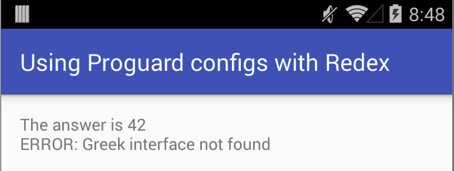

# Using ProGuard Rules with Redex

Currently there is limited support for specifying ProGuard rules which
Redex will try to honor when it considers deleting (shrinking) classes,
methods and fields.

## The Need To Control Shrinking
One of the optimizations that Redex performs is to remove interfaces that
have only one implementation. However, when there is a use of that interface
through reflection or constructs like `instanceof` then this is an unsafe
removal which should be prohibited by using a ProGuard rule.

## Example
Consider the following interface:
```java
package com.facebook.redex.examples.proguardexample;

public interface Greek {
    int doubleWombat();
}
```
which only has one use:
```java
package com.facebook.redex.examples.proguardexample;

public class Alpha implements Greek {

    private int wombat;

    public Alpha () {
        wombat = 21;
    }

    public int doubleWombat() {
        return 2 * wombat;
    }
}
```
and is instantiated in a main activity as follows:
```java
package com.facebook.redex.examples.proguardexample;

import android.support.v7.app.AppCompatActivity;
import android.os.Bundle;
import android.widget.TextView;

public class MainActivity extends AppCompatActivity {

    @Override
    protected void onCreate(Bundle savedInstanceState) {
        super.onCreate(savedInstanceState);
        setContentView(R.layout.activity_main);
        TextView textView = (TextView) findViewById(R.id.message);

        Alpha alphaObject = new Alpha();
        int ltuae = alphaObject.doubleWombat();
        textView.setText("The answer is " + ltuae + "\n");

        try {
            Class<?> greek = Class.forName("com.facebook.redex.examples.proguardexample.Greek");
            if (greek.isInstance(alphaObject)) {
                textView.append("Alpha is an instance of Greek");
            } else {
                textView.append("Alpha is not an instance of Greek");
            }
        } catch (ClassNotFoundException e) {
            textView.append("ERROR: Greek interface not found");
        }
    }
}
```
When you make a release build of this application and then process it with Redex you will get a crash
because the `Greek` class will be removed because it only has a single implementation, but Redex
did not notice that `Greek` is used as part of an `instanceof` check (or there could have been some
use of reflection that mentioned the Greek class). Running the app gives the following output
on the display of the device:



You can instruct Redex to prevent a class or interface from begin deleted by providing
a [ProGuard](http://proguard.sourceforge.net/manual/usage.html#keepoptions) rule. In this
case we want to ensure the `Greek` interface is not deleted:

```
-keep interface com.facebook.redex.examples.proguardexample.Greek
```

When you run Redex you can specify a single ProGuard file containing simple keep rules for classes
and interfaces. For example:

```sh
$ redex -o myfasterapp.apk myapp.apk -P proguard-rules.pro --sign -s ~/.android/debug.keystore -p android
```

Now when you run the post-Redex APK you will notice that the `Greek` class has not been stripped away:


## Limitations
Right now we support only simple keep annotations for classes and interfaces. Shortly we will provide
support a richer subset of the ProGuard configuration language.

## Source for Example
The source code for this example can be found in this directory.
